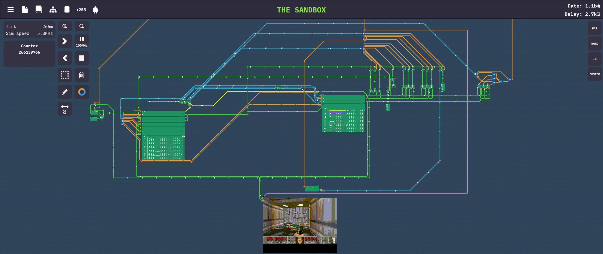
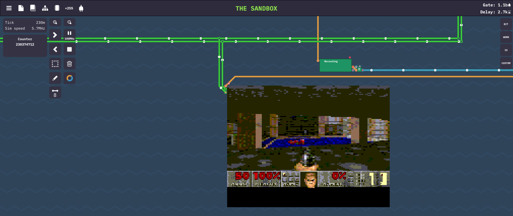

# Doom Headerless 
Doom Headerless is fork of [Doom Generic](https://github.com/ozkl/doomgeneric) made to be easily portable on platforms without C headers. 

This started as port of Doom to game Turing Complete. I started with removing parts that I did not need (Sound, Network, ..), but it is still enough
to comfortably play `doom1.wad`.

Other features:
- Fully 32-bit (original Doom Generic uses 64-bit operations for FixedMul/FixedDiv)
- DIV2 mode to use 160x100 window (normal Doom HUD uses 320x200)
- CMAP256 - 8-bit color mode with palette remapping

To try it you will need a WAD file (game data). If you don't own the game, shareware version is freely available (doom1.wad).

# porting
To port Doom Headerless, you have to implement these functions:

|Functions            |Description|
|---------------------|-----------|
|DG_Init              |Initialize your platfrom (create window, framebuffer, etc...).
|DH_remap_palette     |In 8-bit color mode, remap the original colors into colors of your screen, will be faster than converting later
|DH_setup_screen_info |In x-bit color mode, specify how colors are laid out.
|DG_DrawFrame         |Frame is ready in DG_ScreenBuffer. Copy it to your platform's screen (Can be empty, if DG_ScreenBuffer points to real screen in correct format).
|DG_SleepMs           |Sleep in milliseconds (may be empty).
|DG_GetTicksMs        |The ticks passed since launch in milliseconds.
|DG_GetKey            |Provide keyboard events.
|DH_read_wad          |Copy bytes from WAD.
|I_ZoneBase           |One time allocation for Doom allocator. (Point to 8-16 MiB of free memory)
|malloc_lump_info     |One time allocation.
|memcpy               |Implement fast memcpy. A lot of time is spent memcpy-ing, so it is better to special case it for your platform.

What to look at:
- `doomgeneric_defines.h` defines CMAP256 and DIV2 that influence the screen type.
- `doomgeneric.h` defines functions that you need to implement and call.
- `doomgeneric_xlib.c` only remaining implementation that you can test on your machine, intended to be built with either `make doomgeneric` or `make single_c`
- `doomgeneric_doom64.c` the main implementation for my custom architecture. Although you cannot compile it or run it, it is most useful as starting point. Intended to be built with `make doom64`.
- `i_video.c` if `DG_DrawFrame` is too slow and you have untypical display, you may want to modify `I_FinishUpdate` directly.

## In Turing Complete

## With 160x100 window

